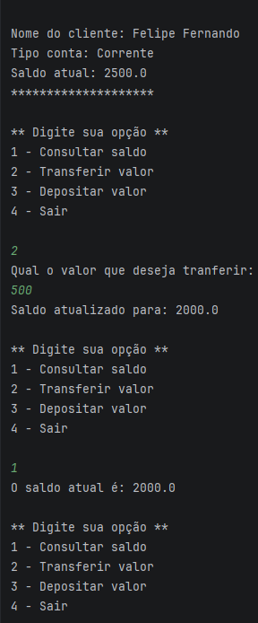

# Bank Account System

## 📖 Sobre o projeto

Este projeto simula um sistema bancário simples desenvolvido em Java.

O sistema permite ao usuário consultar o saldo da conta, realizar depósitos, transferências e interagir com um menu através do terminal.

## 🚀 Funcionalidades

- Consultar o saldo da conta.
- Realizar depósitos.
- Efetuar transferências.
- Validar saldo insuficiente para transferência.
- Interagir com o sistema por meio de um menu no terminal.

## 🛠️ Tecnologias utilizadas

- Java
- IntelliJ IDEA
- Git
- GitHub

## 📚 Conceitos aplicados

- Estruturas condicionais (`if` e `else`).
- Estruturas de repetição (`while`).
- Entrada de dados com `Scanner`.
- Controle de fluxo por meio de menu interativo.
- Operações matemáticas e manipulação de variáveis.

## ▶️ Como executar

1. Clone este repositório.
2. Abra o projeto em uma IDE Java (IntelliJ IDEA, Eclipse ou VS Code).
3. Execute o arquivo `ContaBancaria.java`.
4. Interaja com o sistema pelo terminal.

## 📷 Demonstração

## 👨‍💻 Autor

Desenvolvido por **Felipe Fernando**.

🔗 GitHub: <https://github.com/felipebss0593>
